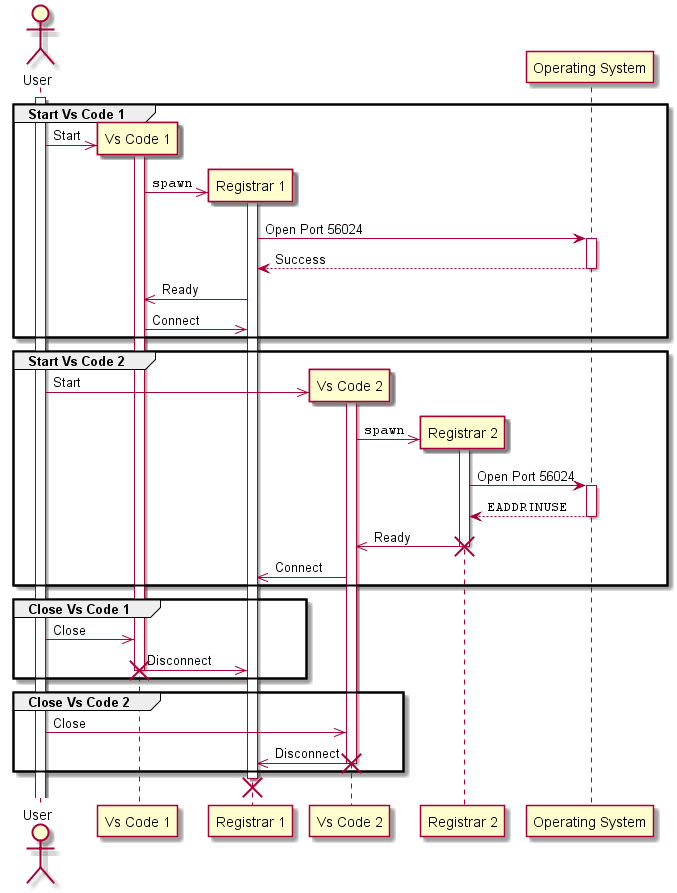
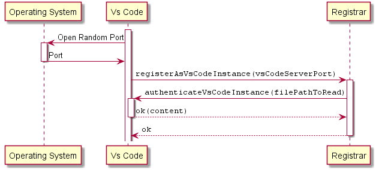
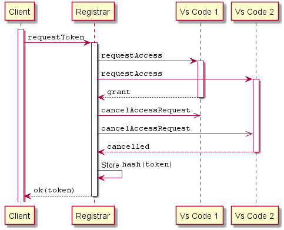
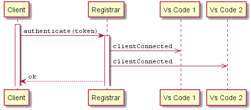
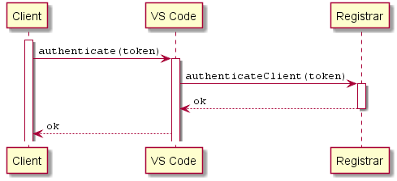

# VS Code RPC

This repository contains an RPC Server for VS Code (implemented as extension) and a NodeJS client implementation.

## Scenarios

See [contracts.ts](vscode-rpc/src/contracts.ts) for the RPC contract definitions.

### Registrar

To support controlling multiple Vs Code instances, there is a registrar-server process that is connected to all VS Code instances and to all clients.
This server broadcasts notifications from clients to VsCode instances and vice versa and listens on a fixed port.

Each VS Code instance has a connection to the registrar server and hosts its own server on a random port.
The registrar server can be asked to get a list of all available Vs Code instances and their server ports.
The registrar server is also responsible for authenticating clients.

The first Vs Code instance spawns the registrar and the registrar exits with the disconnect of the last Vs Code client as shown in the folling sequence diagram:

### VS Code Instances

After ensuring that the registrar has started, each VS Code instance authenticates to the registrar server:

### Tokens

Authentication is implemented using tokens. Tokens are managed by the registrar.
Prior to issueing a new token, the registrar asks all VS Code instances to grant or deny the token request:

### Client Authentication

Clients must authenticate to the registrar before send any requests or notifications:

If clients connect to a VS Code instance directly, they also have to authenticate:

